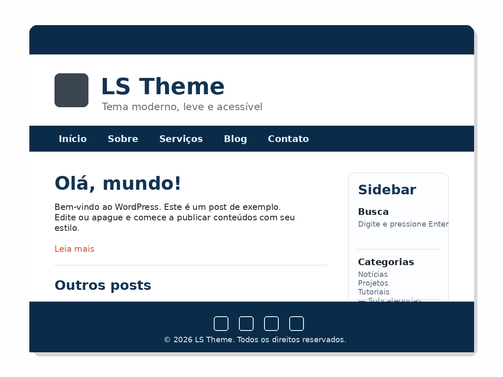

# Independent Theme

**Tema WordPress gratuito, acessível e versátil com 7 estilos visuais.**

Desenvolvido por **Leandro Souza** — uma pessoa cega — para que outras pessoas cegas possam criar sites bonitos para quem enxerga.



---

## 🎨 Estilos Visuais

Troque o visual do seu site em segundos, sem mexer em código:

| Estilo | Ideal para |
|---|---|
| ⬜ Padrão | Sites institucionais e projetos em geral |
| 🎧 Neon Pop | Rádios jovens, podcasts, música eletrônica |
| 📻 Vintage Café | Rádios retrô, jazz, música clássica |
| ⚽ Campo e Paixão | Futebol, esportes, torcidas |
| ✝️ Céu e Fé | Igrejas, rádios gospel, ministérios |
| ✍️ Tinta & Papel | Escritores, blogs literários, jornalismo |
| 🏛️ Marinelli Drupal | Sites institucionais clássicos |

---

## ♿ Acessibilidade

Este tema foi construído com acessibilidade como prioridade:

- Navegação completa por teclado
- Compatível com leitores de tela (NVDA, JAWS, VoiceOver)
- Contraste WCAG AA em todos os estilos
- Skip-link para pular ao conteúdo principal
- `aria-label`, `aria-expanded` e `aria-hidden` implementados corretamente
- Botões e links com área de toque mínima de 44px (WCAG 2.5.5)
- Menu hambúrguer com labels dinâmicos ("Abrir menu" / "Fechar menu")
- Botão de menu e busca ocultos para leitores de tela em desktop

---

## ⚙️ Recursos do Personalizador

Tudo configurável em **Aparência → Personalizar**, sem código:

- 🎨 Estilo visual (7 opções)
- 🖼️ Largura, altura e escala da logo
- 📐 Layout do cabeçalho (esquerda, centralizado, empilhado)
- 🔍 Mostrar/ocultar busca no cabeçalho
- 📅 Ano de fundação (copyright automático: © 2013–2026)
- 🔗 Redes sociais: WhatsApp, Facebook, Instagram, YouTube

---

## 📥 Instalação

### Pelo painel WordPress
1. Baixe o arquivo `.zip` em [Releases](../../releases)
2. Vá em **Aparência → Temas → Adicionar Novo → Enviar tema**
3. Selecione o `.zip` e clique em **Instalar agora**
4. Ative o tema
5. Acesse **Aparência → Personalizar** e escolha seu estilo

### Via Git
```bash
cd wp-content/themes/
git clone https://github.com/seu-usuario/independent-theme.git
```

---

## 📋 Requisitos

- WordPress 6.5 ou superior
- PHP 7.4 ou superior

---

## 🏛️ Sobre o estilo Marinelli

Uma homenagem ao clássico tema **Marinelli do Drupal 7** — recriado fielmente no WordPress com o azul-aço característico, o laranja no hover do menu, a busca com campo azul e borda branca, e a tipografia Helvetica institucional.

> *"Durante muito tempo, enquanto usava Drupal, o Marinelli foi o tema da Rádio Maior Amor."*
> — Leandro Souza

---

## 📄 Licença

GNU General Public License v2 ou posterior.
Veja [LICENSE](LICENSE) para mais detalhes.

Você é livre para usar, modificar e distribuir este tema, desde que mantenha a mesma licença.

---

## 🤝 Contribuindo

Contribuições são bem-vindas!

1. Faça um fork do repositório
2. Crie uma branch: `git checkout -b minha-melhoria`
3. Faça o commit: `git commit -m 'Adiciona minha melhoria'`
4. Envie: `git push origin minha-melhoria`
5. Abra um Pull Request

---

## 👤 Autor

**Leandro Souza**
- Site: [maioramor.com.br](https://maioramor.com.br)

---

*Feito com ❤️ e muita determinação.*
